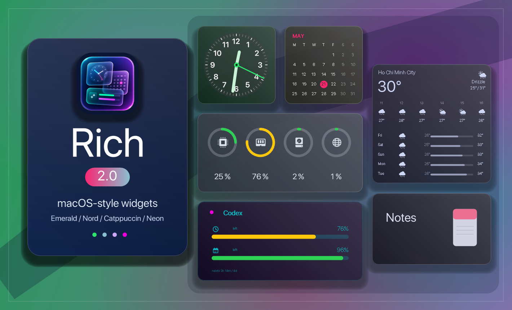
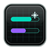

  A MacOS style widget pack for Windows

  Inspired by [Big Sur for Rainmeter](https://www.deviantart.com/fediafedia/art/Big-Sur-RC1-for-Rainmeter-846882462)

## Get started

1. Install [Rainmeter](https://www.rainmeter.net/)
2. Get our [latest release](https://github.com/Fly-onlyone/Rich/releases)
3. Run `Rich.rmskin`

## Wiki

Rich shares the architecture of **Monterey for Rainmeter**, so its guides still apply — see the [User guide](https://github.com/creewick/MontereyRainmeter/wiki/User-guide), [Performance Index](https://github.com/creewick/MontereyRainmeter/wiki/Performance-Index), and [Documentation](https://github.com/creewick/MontereyRainmeter/wiki/Documentation).
> 🛠 **Contributors:** in-repo developer docs live in [`obsidian/`](./obsidian/_HOME.md) — a graph-linked Obsidian vault. Open the folder as a vault, or browse the markdown directly.

## What will you get

### Widgets

We have 10 widgets available

|Icon|Widget|Description|
|-|-|-|
||**Clock**|Shows current time of any timezone, with or without seconds|
||**Calendar**|Shows current month view, with Monday or Sunday as first day of week|
||**Music**|Allows you to control music player Supported players: WMP, AIMP, CAD, iTunes, Spotify, YouTube, Winamp|
||**Weather**|Shows hourly and daily forecast. You can change the forecast by entering your city name|
||**Monitor**|Shows current CPU, RAM, Disk, Network and Battery levels|
||**Volume**|Allows you to control system volume, volume per app, mute apps and switch output devices|
||**Notes**|Gives you a quick access to your most important text information|
||**Reminders**|A basic to-do list with counter|
||**Timer**|A basic countdown with an alarm sound|
||**AI Usage**|Shows how much of your Claude or Codex 5-hour and 7-day rate-limit budget remains|

### Sizes

Each widget comes in 4 sizes, you can switch between them in the context menu

|Name|Size|
|-|-|
|Small|1x1|
|Medium|2x2|
|Wide|4x2|
|Large|4x4|

### Themes

Widgets can use built-in color palettes and a separate visual effect. Each palette also carries its own signature **accent color** — used for the clock's second hand and the calendar's current-day highlight — so the themes stay visually distinct.

|Palettes|Effects|
|-|-|
|Light, Dark, Dracula, Catppuccin, Solarized, Nord, Gruvbox, Tokyo Night, One Dark, Monokai, Rose Pine, Everforest, Cyberpunk, Emerald, Ocean|Solid, Auto, Wallpaper, Blur *|

_* Blur currently works well only on Windows 11_
### Languages

So far we support 4 languages

| |Language|
|-|-|
|| Russian |
|| Ukrainian |
|| English |
|| German |

## Special thanks

| User | Credit |
|-|-|
| [creewick](https://github.com/creewick) | [Monterey for Rainmeter](https://github.com/creewick/MontereyRainmeter) — the original widget pack Rich is based on |
| [fediaFedia](https://github.com/fediaFedia) | [Big Sur for Rainmeter](https://www.deviantart.com/fediafedia/art/Big-Sur-RC1-for-Rainmeter-846882462) |
| [socks-the-fox](https://github.com/socks-the-fox) | [Chameleon plugin](https://github.com/socks-the-fox/Chameleon) |
| [i2002](https://github.com/i2002) | [MediaPlayer plugin](https://github.com/i2002/RainmeterMediaPlayer) |
| [khanhas](https://github.com/khanhas) | [AppVolume plugin](https://github.com/khanhas/AppVolumePlugin) |
| [jsmorley](https://github.com/jsmorley) | [ConfigActive plugin](https://github.com/jsmorley/ConfigActive) |
| [fawyWolf](https://github.com/FawyWolf) | English, Ukrainian translations |
| [ikarus1969](https://github.com/ikarus1969) | German translation |
| [ActiveColor](https://deviantart.com/activecolors) | helped with persisting settings, code review |
| [kalukal](https://www.deviantart.com/kalukal) | Unlock animation idea |

## Works good with
* [Centered taskbar icons - TaskbarX](https://chrisandriessen.nl/taskbarx)
* [MacOS menu bar - Droptop Four](https://github.com/Droptop-Four)
* [Rounded screen corners](https://forum.rainmeter.net/viewtopic.php?t=25780#p201917)
* [MacOS dock and menu bar - MyDockFinder](https://store.steampowered.com/app/1787090/MyDockFinder)

