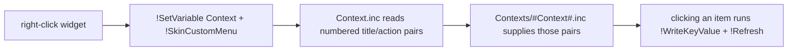

# Context Menu Flow

> Right-clicking a widget opens a custom menu. The menu's contents are not fixed — they
> are chosen by the `Context` variable, which routes to one of the `Contexts/*.inc` files.

## Source

- `@Resources/Scripts/Includes/Context.inc` — the menu template
- `@Resources/Scripts/Contexts/*.inc` — one file per menu
- each widget's `RightMouseUpAction`

## How it works

`Context.inc` exposes a fixed set of numbered `ContextTitle` / `ContextAction` slots; the
active `Contexts/*.inc` fills them. Submenus (e.g. the three-file
[[Timezone Context Menu]]) page by re-setting `Context`. Selecting an item persists the
choice via [[Settings Persistence Flow]] and marks itself with a [[Tickmark Indicator]].

## Depends on

- [[Context Scaffold]]
- [[Context Menu Factory Pattern]]

## Used by

- Every widget; see [[02-Framework/Contexts/_index|Contexts]]

## See also

- [[_index]]
- [[Settings Persistence Flow]]
