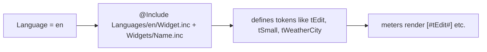

# Localization Flow

> All user-facing text is indirected through `#t…#` token variables; switching the
> `Language` variable swaps which folder of token definitions is `@Include`d.

## Source

- `@Resources/Variables/Global.inc` — holds `Language` (`en`, `ru`, `ua`, `de`)
- `@Resources/Languages/all.inc` — the registry of language display names
- `@Resources/Languages/<lang>/` — per-language token files

## How it works

Each language folder mirrors the same layout (`Widget.inc`, `Settings.inc`,
`Widgets/*.inc`, `Settings/*.inc`, `Extras/*.inc`). A meter never hardcodes text — it
writes `[#tSomeKey#]`, the nested-variable form, which resolves to the translated string.
Adding a language means cloning a folder; see [[Adding a New Language]].

## Depends on

- [[Skin Composition Flow]] — language files are part of the include cascade

## Used by

- Every widget, every settings page, the [[Language Context Menu]]

## See also

- [[_index]]
- [[Localization Token Pattern]]
- [[Adding a New Language]]
