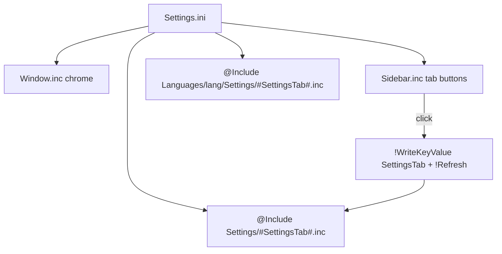

# Settings Panel Flow

> The settings UI is a separate skin (`Settings.ini`) — not a widget. It shows one tab
> at a time, chosen by the `SettingsTab` variable, and `@Include`s that tab's content.

## Source

- `Settings.ini` (repo root) — the settings-window skin
- `@Resources/Scripts/Includes/Window.inc` — window chrome
- `@Resources/Scripts/Settings/*.inc` — one file per tab

## How it works

Clicking a sidebar button writes `SettingsTab` and refreshes; the refreshed skin
`@Include`s the matching `Settings/<Tab>.inc` plus its language file. Tabs that change
widget appearance write through the [[Settings Persistence Flow]] and refresh the
`Monterey` skin group so widgets pick up the change.

## Depends on

- [[Settings Tab Dispatch]]
- [[Window Scaffold]]

## Used by

- All pages in [[02-Framework/Settings/_index|Settings]]

## See also

- [[_index]]
- [[Context Menu Flow]]
