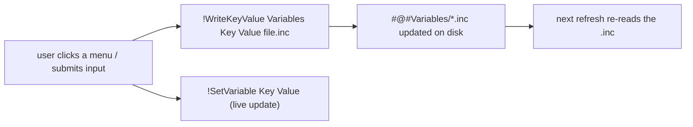

# Settings Persistence Flow

> Rainmeter skins are stateless between refreshes — so every user choice is written back
> into a `.inc` file under `@Resources/Variables/`, which is re-read on the next load.

## Source

- `@Resources/Variables/Global.inc` — skin-wide settings
- `@Resources/Variables/<Widget>.inc` — per-widget settings
- `@Resources/Variables/Layout.inc` — per-widget chosen size

## How it works

The `!WriteKeyValue` bang edits the `.inc` on disk; a paired `!SetVariable` applies the
change immediately without a refresh. Lua scripts wrap both in the
[[Lua Set-And-Save Pattern]] helper `setAndSave`. Because writes target the *shipped*
default files, editing a `Variables/*.inc` directly also changes the out-of-box defaults.

## Depends on

- [[Global Variables]]
- [[Per-Widget Variables]]
- [[Layout State]]

## Used by

- [[Context Menu Flow]], every settings page, [[Notes Text Editing]], [[Timer State Machine]]

## Gotchas

- `!WriteKeyValue` is a disk write — rapid repeated writes can race; widgets update the
  live variable first and let the file catch up.

## See also

- [[_index]]
- [[Settings Persistence Pattern]]
