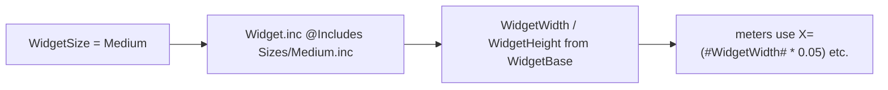

# Sizing Flow

> One variable, `WidgetSize`, decides a widget's dimensions: the scaffold `@Include`s a
> size file that sets `WidgetWidth` / `WidgetHeight`, and every meter is positioned by
> expressions of those.

## Source

- `Widgets/<Name>/<Size>.ini` — sets `WidgetSize`
- `@Resources/Scripts/Includes/Widget.inc` — `@Include`s `Sizes/#WidgetSize#.inc`
- `@Resources/Scripts/Sizes/*.inc` — `Small`, `Medium`, `Wide`, `Large`

## How it works

Each size file computes `WidgetWidth` / `WidgetHeight` from [[WidgetBase Grid Unit]]
(`WidgetBase = 75`, `PaddingBase = 8`). Because meters position themselves with
*proportional* expressions rather than fixed pixels, the same widget logic renders
correctly at all four sizes — see [[Proportional Layout Pattern]].

## Depends on

- [[Size Definitions]]
- [[WidgetBase Grid Unit]]

## Used by

- Every widget (one `.ini` per size)

## See also

- [[_index]]
- [[Skin Composition Flow]]
- [[Proportional Layout Pattern]]
