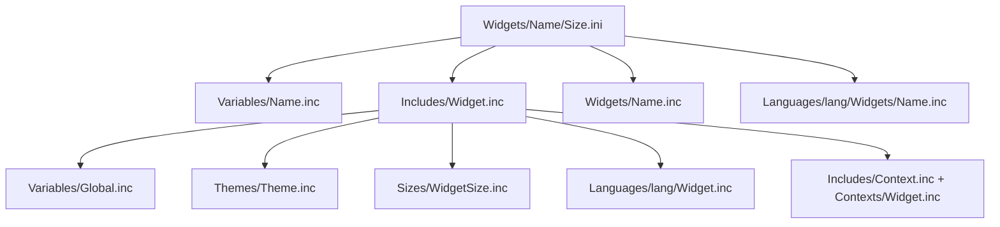

# Skin Composition Flow

> A widget is never written in one file — it is assembled at load time from a cascade of
> `@IncludeN` directives that splice together variables, scaffold, logic, theme, size,
> language, and the context menu.

## Source

- `Widgets/<Name>/<Size>.ini` — the thin entry file
- `@Resources/Scripts/Includes/Widget.inc` — the shared scaffold hub
- `@Resources/Scripts/Widgets/<Name>.inc` — per-widget measures and meters

## How it works

A size file sets only `WidgetName` / `WidgetSize` and chains four includes; the scaffold
it pulls in chains six more.

Because theme, size, and language are chosen by *variables* (`#Theme#`, `#WidgetSize#`,
`#Language#`), the same widget renders differently just by swapping which file an
`@Include` resolves to.

## Depends on

- [[Widget Scaffold]] — the hub of the cascade
- [[Include Cascade Pattern]] — the rule that governs `@IncludeN` numbering

## Used by

- Every widget in [[01-Widgets/_index|Widgets]]

## Gotchas

- `@IncludeN` numbers must be unique within a `[Variables]` section — a reused number
  silently overrides the earlier include.

## See also

- [[_index]]
- [[Theming Flow]]
- [[Sizing Flow]]
