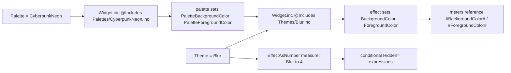

# Theming Flow

> Two variables repaint every widget: `Palette` chooses fixed colors, while `Theme`
> now chooses the visual effect that applies those colors or replaces them dynamically.

## Source

- `@Resources/Variables/Global.inc` — holds `Palette` and `Theme`
- `@Resources/Scripts/Includes/Widget.inc` — `@Include`s `Palettes/#Palette#.inc` and `Themes/#Theme#.inc`
- `@Resources/Scripts/Palettes/*.inc` — fixed color palette files
- `@Resources/Scripts/Themes/*.inc` — effect files (`Solid`, `Auto`, `Color`, `Blur`)

## How it works

`Solid` applies the selected palette directly. `Auto` preserves the old scheduled
light/dark behavior, `Color` preserves wallpaper-derived Chameleon colors, and `Blur`
keeps the FrostedGlass acrylic effect while tinting from the selected palette. The
[[Theme As Number]] note now documents the `EffectAsNumber` compatibility measure.

## Depends on

- [[Theme System]]
- [[Theme As Number]]

## Used by

- Every widget and settings page

## See also

- [[_index]]
- [[Skin Composition Flow]]
- [[Theme-As-Number Pattern]]
