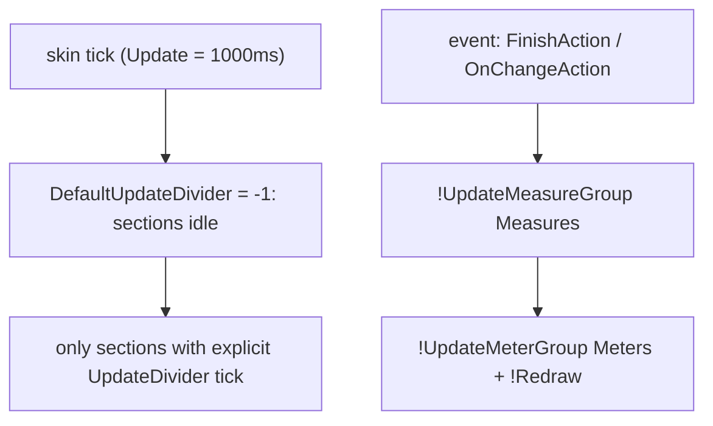

# Update & Refresh Model

> Rainmeter ticks each skin on a timer. Monterey keeps that tick cheap by disabling
> per-section updates globally and refreshing measures/meters explicitly in groups.

## Source

- `@Resources/Scripts/Includes/Window.inc` — `Update`, `DefaultUpdateDivider`
- per-widget `.ini` `[Rainmeter]` sections
- `FinishAction` / `OnChangeAction` / `OnRefreshAction` hooks

## How it works

`DefaultUpdateDivider = -1` freezes every section by default; a section opts back in with
its own `UpdateDivider`, or is refreshed on demand. Sections are tagged
`Group=Measures` / `Group=Meters` so an event handler can refresh them wholesale — see
[[Group Bang Pattern]]. A full *refresh* (vs. update) re-parses the `.ini` and re-runs
the [[Skin Composition Flow]].

## Depends on

- [[Group Bang Pattern]]

## Used by

- Every widget; the [[Weather Data Flow]] leans on it heavily

## See also

- [[_index]]
- [[Update Divider]]
- [[Loading & Refreshing Skins]]
