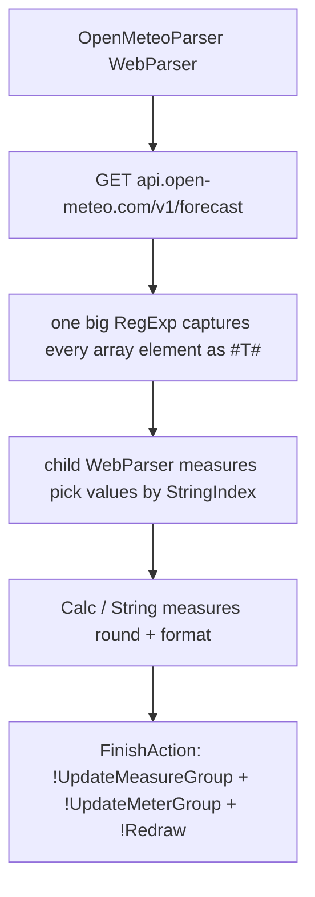

# Weather Data Flow

> The Weather widget fetches one JSON document from Open-Meteo and slices it into dozens
> of measures by *position*, not by key — a fragile but plugin-free approach.

## Source

- `@Resources/Scripts/Widgets/Weather.inc` — parser, measures, weather-code map
- `Widgets/Weather/Settings.ini` — city geocoding
- `@Resources/Variables/Weather.inc` — `Latitude`, `Longitude`, `City`

## How it works

Downstream measures read fixed offsets: current temp = index 2, hourly temps from 4,
hourly codes from 34, daily lows from 64, highs from 70, icons from 76. WMO codes map to
icon names through the `IconName` substitution table. On failure the widget swaps to
[[Weather Error State]].

## Depends on

- [[Open-Meteo API]]
- [[Weather Forecast Parsing]]
- [[Weather City Search]]

## Used by

- [[Weather Widget]]

## Gotchas

- Change the API URL's requested fields and **every** `StringIndex` offset shifts —
  the single most common source of weather bugs.

## See also

- [[_index]]
- [[Debug Measure Pattern]]
