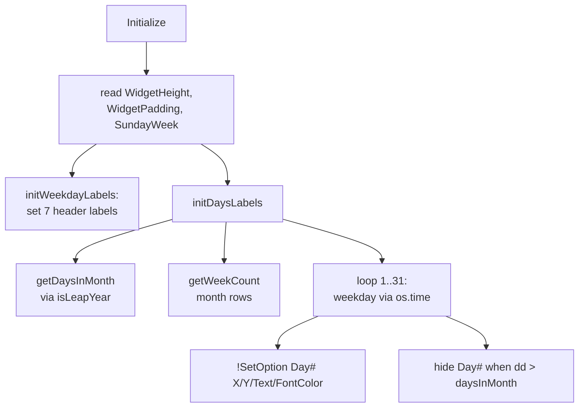

# Calendar Grid Logic

> The Lua routine that computes how many days and weeks the month has, then positions and styles every weekday label and day cell.

## Source

- `@Resources/Scripts/Widgets/Calendar.lua` — `Initialize`, `getDaysInMonth`, `isLeapYear`, `getWeekCount`, `initDaysLabels`, `initWeekdayLabels`

## How it works

`getDaysInMonth` indexes a month-length table, returning 29 for February in a leap year. `getWeekCount` finds how many week-rows the month spans by adding leading blank days. For each day `1..31`, `os.time` yields the weekday; the cell's X is a column fraction (`Size/8`) and Y depends on the running week counter. Days beyond the month length are hidden via `!SetOption`.

## Depends on

- [[Group Bang Pattern]] — meters carry `Group=Meters` for batch updates
- [[Per-Widget Variables]] — reads `WidgetHeight`, `WidgetPadding`, `SundayWeek`
- [[Week Start Setting]] — `SundayWeek` shifts column placement

## Used by

- [[Calendar Widget]]
- [[Calendar Today Highlight]] — Lua positions `RedCircle`

## Gotchas

- `isLeapYear` uses `year%4==0 or (year%100~=0 and year%400==0)` — non-standard but correct for all years 1901-2099.

## See also

- [[_index]]
- [[Calendar Today Highlight]]
