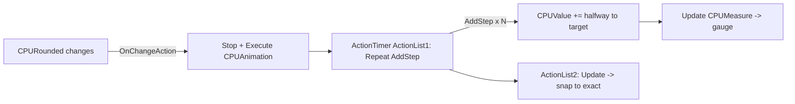

# Monitor Gauge Animation

> An ActionTimer-driven easing loop that smoothly moves each Monitor gauge from its old value toward the newest reading instead of snapping.

## Source

- `@Resources/Scripts/Widgets/Monitor.inc` — `CPUAnimation`, `RAMAnimation`, `DiskAnimation`, `NetAnimation`, `ActionList`, and the `#...Value#` variables

## How it works

Each metric has an [[ActionTimer Plugin]] measure. When the `Rounded` [[Measure]] changes, its `OnChangeAction` stops then re-executes the animation `ActionList`. `AddStep` nudges the `#CPUValue#` variable halfway toward the target each step (`Value + (target - Value)/2`); a final `Update` snaps it exactly. The gauge `Calc` measure (`CPUMeasure`) reads `#CPUValue#`.

The `[ActionList]` [[Measure]] resolves to `1 + #BatterySaverMode#`, so the easing runs one pass normally and two in saver mode. `OnRefreshAction` kicks all four animations on skin load.

## Depends on

- [[ActionTimer Plugin]] — runs the stepped [[Bang]] list
- [[Monitor Metrics]] — supplies the `Rounded` target values
- [[DynamicVariables Pattern]] — `#...Value#` must re-resolve each step

## Used by

- [[Monitor Widget]] — gauges/histograms render the eased value

## Gotchas

- Stop-then-Execute on every change cancels any in-flight animation so rapid updates don't queue up.

## See also

- [[_index]]
- [[Group Bang Pattern]]
