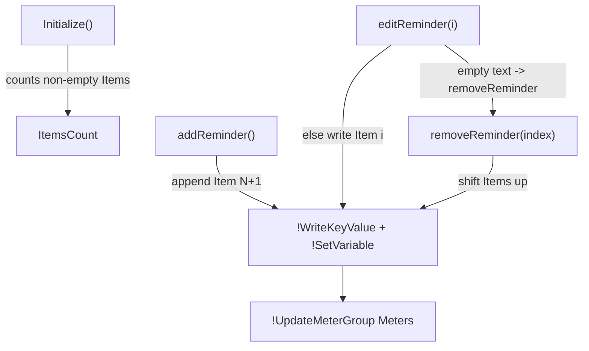

# Reminders List Logic

> The Lua script that adds, edits, removes, and counts reminder items and keeps their indices contiguous.

## Source

- `@Resources/Scripts/Widgets/Reminders.lua` — `getRemindersCount`, `addReminder`, `removeReminder`, `editReminder`, `editListName`
- `@Resources/Variables/Reminders.inc` — `Item1..ItemN`, `ListName`

## How it works

`getRemindersCount` walks `Item1`, `Item2`… until an empty value. Each function applies the [[Lua Set-And-Save Pattern]]: it `!WriteKeyValue`s the change into `Variables/Reminders.inc` and mirrors it with `!SetVariable` so the meters update without a refresh. `removeReminder` shifts every later item up by one index so the `Item1..ItemN` sequence stays gap-free, then blanks the last slot.

## Depends on

- [[Lua Set-And-Save Pattern]] — write to disk and mirror in memory
- [[InputText Plugin]] — supplies `InputValue`

## Used by

- [[Reminders Widget]]

## Gotchas

- Indices must stay contiguous — `getRemindersCount` stops at the first empty `Item`, so a gap would truncate the list.
- `editReminder` with empty input is treated as a delete.

## See also

- [[_index]]
- [[Settings Persistence Flow]]
