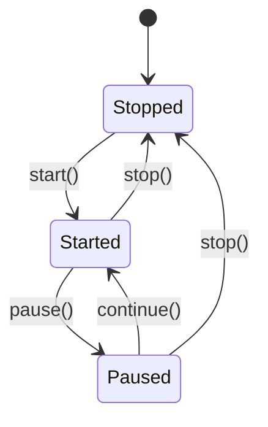

# Timer State Machine

> The three timer modes — stopped, started, paused — derived from three persisted variables and used to gate which buttons and meters are visible.

## Source

- `@Resources/Variables/Timer.inc` — `StartTime`/`EndTime`/`PauseTime` (default `-1`)
- `@Resources/Scripts/Widgets/Timer.inc` — `IsStopped`/`IsStarted`/`IsPaused` measures
- `@Resources/Scripts/Widgets/Timer.lua` — transitions

## How it works

State lives in three persisted variables, each `-1` when unset. Three `Calc` [[Measure]]s derive the mode: `IsStopped` = `StartTime = -1`; `IsPaused` = `PauseTime <> -1`; `IsStarted` = `StartTime <> -1 && PauseTime = -1`.

`Timer.lua`'s `start`/`pause`/`continue`/`stop` functions write the variables via `setAndSave`. Button [[Meter]]s use `Hidden` formulas reading these measures so only the valid controls show.

## Depends on

- [[Lua Set-And-Save Pattern]] — `setAndSave` persists each transition
- [[Per-Widget Variables]] — `StartTime`/`EndTime`/`PauseTime`

## Used by

- [[Timer Widget]] — gates button and meter visibility
- [[Timer Time Arithmetic]] — `continue()` recalculates `EndTime`

## See also

- [[_index]]
- [[Settings Persistence Flow]]
