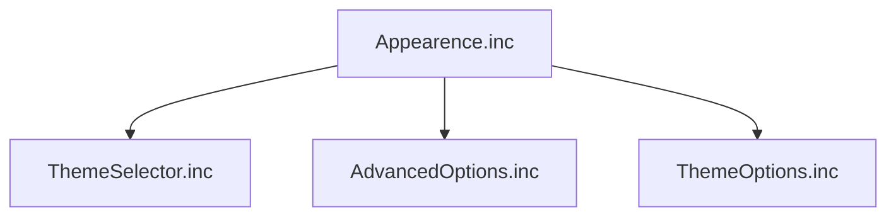

# Appearance Settings Tab

> The settings tab for theming and layout, implemented as a thin container that pulls in three Appearence subfiles.

## Source

- `@Resources/Scripts/Settings/Appearence.inc` — container that `@Include`s the three subfiles

## How it works

`Appearence.inc` itself defines almost nothing — it sets `WidgetHeight=490` and then chains three `@Include` directives that bring in the actual UI:

The three subfiles stack vertically by absolute Y coordinate: [[Theme Selector]] at the top (Y=55), [[Advanced Options]] below the selectors (Y=390), and [[Theme Options]] at the bottom (Y=530). Splitting the tab this way keeps each concern — picking a palette/effect, tuning layout, and editing dynamic-effect options — in its own file.

## Depends on

- [[Theme Selector]] — palette and effect picker subfile
- [[Advanced Options]] — size/padding/radius subfile
- [[Theme Options]] — dynamic-effect options subfile

## Used by

- [[Settings Tab Dispatch]] — loads this file when `SettingsTab=Appearence`

## See also

- [[_index]]
- [[Theming Flow]]
- [[Theme System]]
