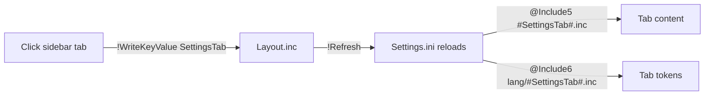

# Settings Tab Dispatch

> The routing mechanism that decides which tab content the settings panel loads, keyed entirely off the `SettingsTab` variable.

## Source

- `Settings.ini` — `@Include5`/`@Include6` resolve `#SettingsTab#` into a content file and its language file
- `@Resources/Scripts/Settings/Sidebar.inc` — tab buttons write `SettingsTab` and refresh
- `@Resources/Variables/Layout.inc` — persists the current `SettingsTab` value

## How it works

Each sidebar tab's `LeftMouseUpAction` runs `!WriteKeyValue Variables SettingsTab "<Name>"` then `!Refresh`. On reload, `Settings.ini` substitutes the new value into `@Include5` and `@Include6`, pulling in both the matching `Scripts/Settings/<Name>.inc` and the language file. `[TabTitle]` echoes the localized name via the `[#t[#SettingsTab]]` token.

## Depends on

- [[Layout State]] — stores `SettingsTab` persistently
- [[Sidebar Settings]] — provides the clickable tab buttons
- [[Settings Persistence Pattern]] — the write-then-refresh idiom

## Used by

- [[Window Scaffold]] — `Settings.ini` is the scaffold this dispatch runs inside

## Gotchas

- `RegionOptions.inc` exists as a tab content file but is **empty/unimplemented** — selecting a "Region" tab would load nothing.
- Dispatch only works if the value written matches an existing `.inc` filename; a typo loads an empty include silently.

## See also

- [[_index]]
- [[Settings Panel Flow]]
- [[Widgets Settings Tab]]
